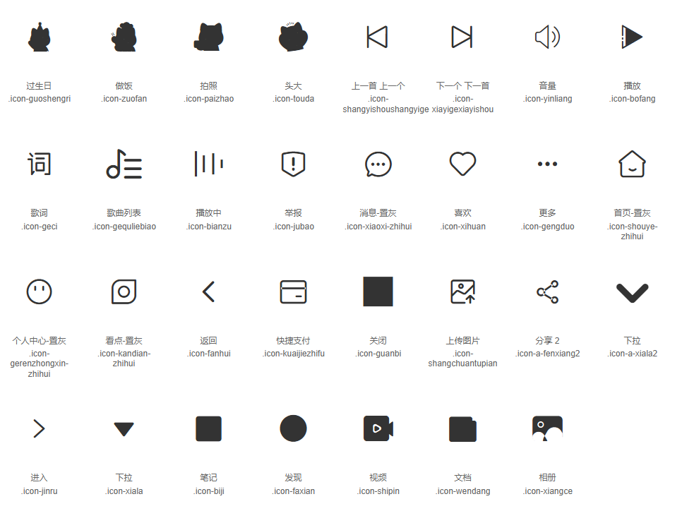

# Button 按钮

按钮用于触发一个操作，如提交表单、打开对话框等。

## 何时使用

- 当需要用户点击执行操作时
- 当需要不同类型的按钮样式来区分操作的重要性时

## 基本用法

### 按钮类型

```tsx
import React from 'react';
import { ProzenButton } from 'prozen-button';

export default () => (
  <div>
    <ProzenButton type="primary">Primary Button</ProzenButton>
    <ProzenButton type="default">Default Button</ProzenButton>
    <ProzenButton type="dashed">Dashed Button</ProzenButton>
    <ProzenButton type="default" success>Success Button</ProzenButton>
    <ProzenButton type="default" warning>Warning Button</ProzenButton>
    <ProzenButton type="default" error>Error Button</ProzenButton>
    <ProzenButton type="primary" round>Link Button</ProzenButton>
    <ProzenButton type="underline" >Link Button</ProzenButton>
  </div>
);
```

### 按钮大小

```tsx
import React from 'react';
import { ProzenButton } from 'prozen-button';

export default () => (
  <div>
    <ProzenButton type="primary" size="small">Small Button</ProzenButton>
    <ProzenButton type="primary" size="default">Default Button</ProzenButton>
    <ProzenButton type="primary" size="large">Large Button</ProzenButton>
  </div>
);
```

### 禁用状态

```tsx
import React from 'react';
import { ProzenButton } from 'prozen-button';

export default () => (
  <div>
    <ProzenButton type="primary" disabled>Disabled Primary</ProzenButton>
    <ProzenButton type="default" disabled>Disabled Default</ProzenButton>
    <ProzenButton type="dashed" disabled>Disabled Dashed</ProzenButton>
  </div>
);
```

### 加载状态

```tsx
import React from 'react';
import { ProzenButton } from 'prozen-button';

export default () => (
  <div>
    <ProzenButton type="primary" loading>Loading Primary</ProzenButton>
    <ProzenButton type="default" loading>Loading Default</ProzenButton>
    <ProzenButton type="dashed" loading>Loading Dashed</ProzenButton>
  </div>
);
```

### 图标按钮

```tsx
import React from 'react';
import { ProzenButton } from 'prozen-button';

export default () => (
  <div>
    <ProzenButton type="primary" icon="jinru">带图标按钮</ProzenButton>
    <ProzenButton type="default" icon="jinru">默认图标</ProzenButton>
    <ProzenButton type="dashed" icon="jinru">虚线图标</ProzenButton>
    <ProzenButton type="primary" icon="guanbi">关闭按钮</ProzenButton>
    <ProzenButton type="primary" icon="bofang">播放按钮</ProzenButton>
  </div>
);
```

## API

| 参数 | 说明 | 类型 | 默认值 |
| --- | --- | --- | --- |
| type | 按钮类型 | `primary` \| `default` \| `dashed` \| `text` \| `link` | `default` | `success` \| `warning` \| `error` |
| size | 按钮大小 | `small` \| `default` \| `large` | `default` |
| disabled | 是否禁用 | `boolean` | `false` |
| loading | 是否加载中 | `boolean` | `false` |
| children | 按钮内容 | `ReactNode` | - |
| style | 自定义样式 | `CSSProperties` | - |
| className | 自定义类名 | `string` | - |
| round | 是否圆角 | `boolean` | `false` |
| success | 是否成功状态 | `boolean` | `false` |
| warning | 是否警告状态 | `boolean` | `false` |
| error | 是否错误状态 | `boolean` | `false` |
| icon | 图标类型 | `string` | - |
| underline | 是否下划线 | `boolean` | `false` |

### 可用图标

支持的图标类型包括：
- `jinru` - 进入箭头  
- `guanbi` - 关闭图标  
- `bofang` - 播放图标
- `fanhui` - 返回图标
- `xihuan` - 喜欢图标
- `gengduo` - 更多图标
- `shouye` - 首页图标
- `xiaoxi` - 消息图标
- `faxian` - 发现图标
- `gerenzhongxin` - 个人中心图标


...



